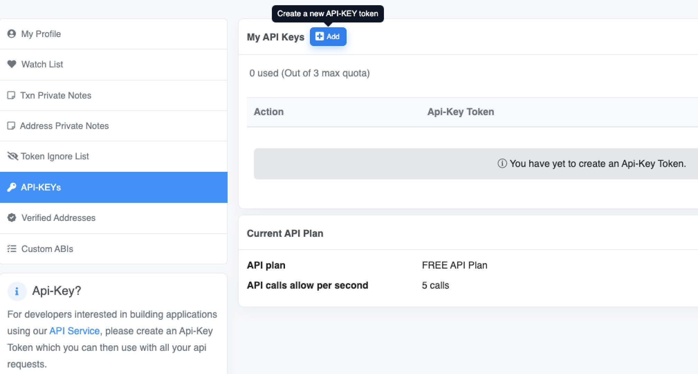
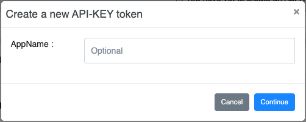

# Block Explorer and API Keys

### Block Explorers



* [https://evm.planq.network/](https://evm.planq.network)
* [https://explorer.planq.network/](https://explorer.planq.network/)



### **Creating API Keys on Planq EVM Explorer**

The Planq EVM Explorer Developer APIs are designed to provide accessible and consistent Planq data to the Planq community. The APIs are provided as a community service with a rate up to five calls per second per IP. Users need to [register](https://evm.planq.network/register) for a Planq EVM Explorer account to create an API key.\
After registration, a Planq EVM Explorer user account will have a quota of up to three API keys.

On the [Planq EVM Explorer user dashboard](https://evm.planq.network/myaccount), select “**API-KEYs**” in the left column or go to [https://evm.planq.network/myapikey](https://evm.planq.network/myapikey).

Click “**Create a new API-KEY token**”. Then optionally input an \_**AppName** \_ if you wish to.

After the “**API**_**-**_**KEY Token**” is successfully created, a message will show up as per the example below. You can now use the “**API key token**” for your applications on Planq!

 (1) (1).png>)
