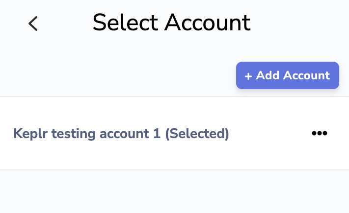
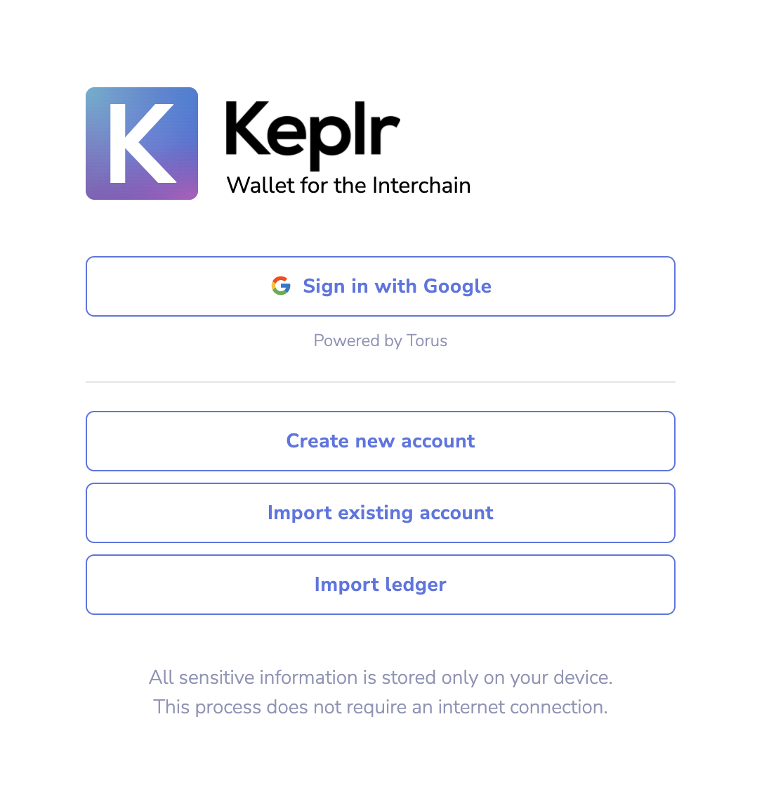

# ⚛ Keplr wallet

**Step 1:** Create or log in to your Keplr wallet

<figure><figcaption></figcaption></figure>

**Step 2:** Click the icon at the top right corner. Then, click “**+ Add Account**”

**Step 3:** Select “**import existing account**”

<figure><figcaption></figcaption></figure>

**Step 5:** You now have a wallet, and simply need to add the Planq network to Keplr Wallet. The easiest way to add this Planq to the Keplr wallet is by visiting the [Keplr chain page](https://chains.keplr.app/). On this page search for Planq.

<figure><figcaption></figcaption></figure>

You can transact with the Keplr Wallet on the Planq Network
