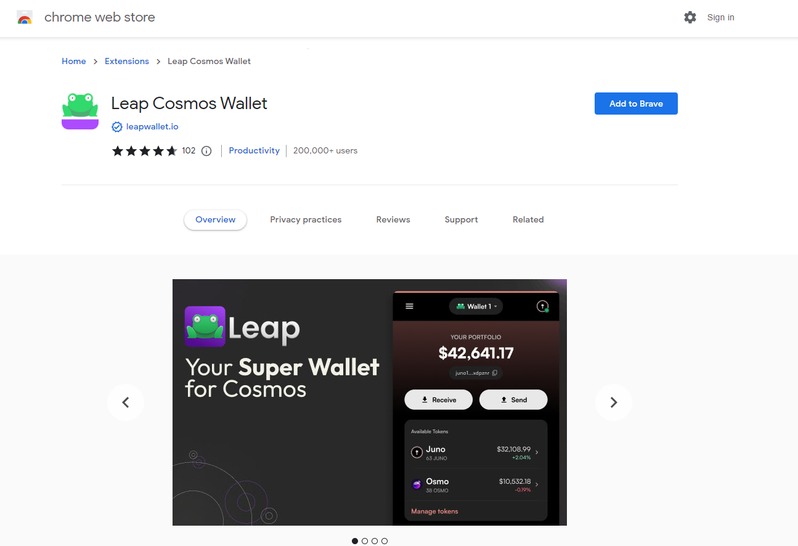

# 🔥 Crypto Wallets

Planq is supported by more than 30 wallets, some of which are shown [here](https://planq.network/ecosystem).&#x20;

## Leap Wallet

The [Leap Wallet](https://www.leapwallet.io/download) is a self-custodial crypto wallet developed by Crypto.com. It supports Planq and dozens of Planq cryptocurrencies natively, as well as all NFTs on the Planq chain. The wallet is available in 3 user interfaces:

* The mobile wallet, available for iOS and Android (download [here](https://www.leapwallet.io/download)). The mobile app includes a powerful in-app browser to interact with decentralized applications (DeFi, NFTs and Web3 Gaming).
* The browser extension, available from the Chrome store [here](https://chrome.google.com/webstore/detail/leap-cosmos-wallet/fcfcfllfndlomdhbehjjcoimbgofdncg/).

The DeFi Wallet is not just for DeFi. One unique feature of the Leap Wallet mobile app is the NFT tab, where you can see, transfer, buy and sell all your self-custodial NFTs on Planq chain.

You can import your accounts from any other self-custodial crypto wallet into the Leap Wallet by importing your seed phrase under "Import wallet".

## Ledger hardware wallet

You can now use your Ledger hardware wallet on Planq chain.

In the Ledger Live companion app, you can see your PLQ holdings on Planq chain. This can be accomplished by selecting "Add account" and then Planq (PLQ):

## Keplr Wallet

Keplr Wallet also support Planq chain and dApps natively. You can download it [here](https://www.keplr.app/download).

## MetaMask

MetaMask can be used to check your cryptocurrency balances on Planq and to interact with decentralized applications. You can download it [here](https://metamask.io/).

The MetaMask mobile app and browser extension require additional configuration steps to connect to Planq chain. See [MetaMask configuration](metamask.md) for an easy-to-follow guide.

## Brave Wallet

The crypto wallet developed by Brave Browser can also be used to check your cryptocurrency balances on Planq and to interact with decentralized applications.

See [Brave Wallet](brave-wallet.md) for an easy-to-follow guide of configuration steps.

