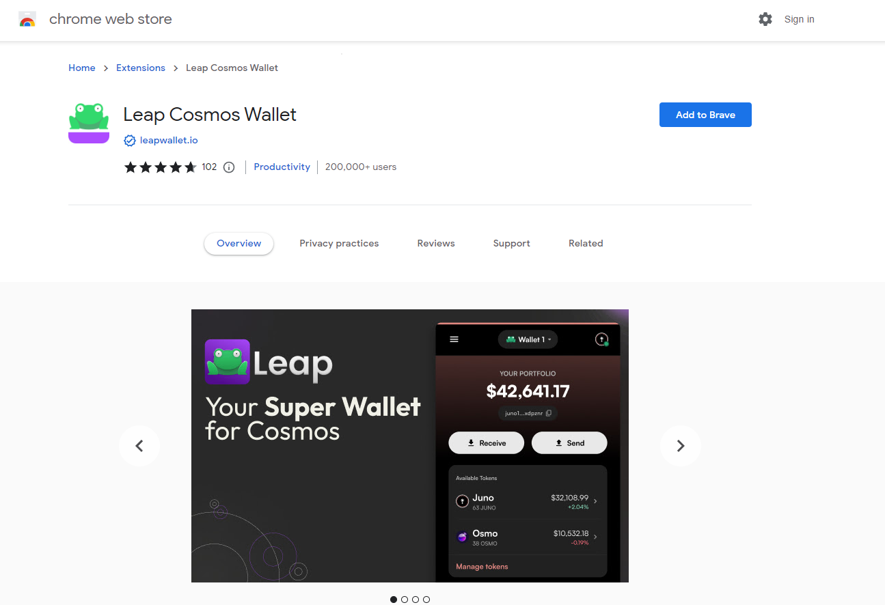

# 🐸 Leap Wallet

**Step 1: Download Leap Wallet**&#x20;

Download leap wallet [here](https://www.leapwallet.io/download).&#x20;

<figure><figcaption></figcaption></figure>

Click on ''Add to Brave''. if you are using a different browser it will say add to Chrome, for example.

You can now choose to import an existing wallet, but for this example, we assume you create a new wallet.

<figure><figcaption></figcaption></figure>

**Step 2: Create the wallet**

Follow the steps of creating a leap wallet to the end. Don't forget to save or write down your Secret Recovery Phrase somewhere safe. After that you should be met with the following screen:&#x20;

<figure><figcaption></figcaption></figure>

**Step 3: get to know Leap**

You now have the Leap browser extension installed. Planq is natively integrated so there is no need to connect or add the network.

<figure><figcaption></figcaption></figure>

Leap also offers a [dashboard ](https://cosmos.leapwallet.io/portfolio/overview)where you can easily interact with Planq.

<figure><figcaption></figcaption></figure>
